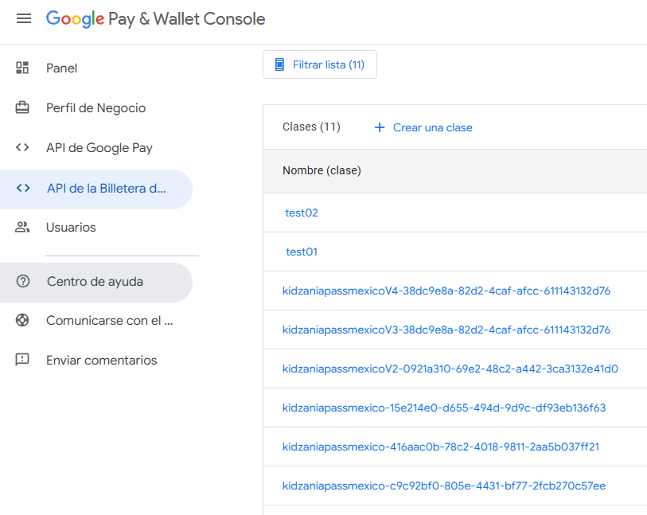
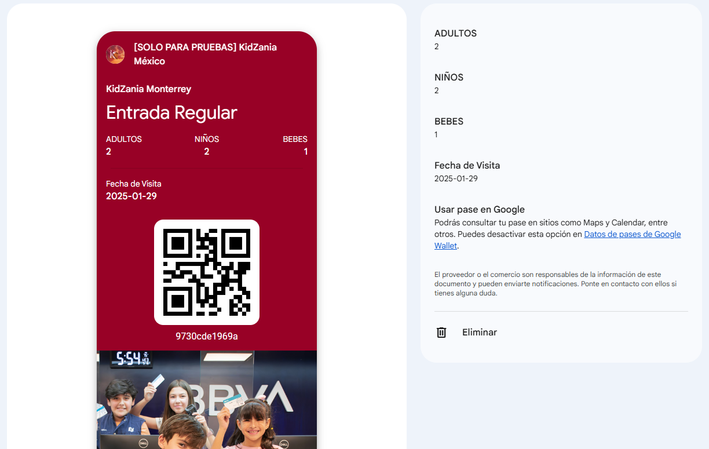

# Documentación de Endpoints de la API Demo de Google Wallet | Digital Ignition

Esta documentación describe los dos endpoints disponibles en el servicio para la integración con Google Wallet.

---

## **1. Crear Clase**

### Endpoint:

`POST http://{baseUrl}/api/wallet/create-class`

### **Descripción:**

Este endpoint se utiliza para crear una clase en Google Wallet. **Debe ejecutarse una sola vez**, ya que la clase sirve como plantilla para los pases que se crearán posteriormente.

### **Detalles:**

- Este servicio utiliza la plantilla definida en el archivo `googleWalletController` para establecer la configuración de la clase.
- La clase creada se almacena en Google Wallet y se usará como base para todos los pases asociados.

## 

## **2. Crear o Consultar Pase**

### Endpoint:

`POST http://{baseUrl}/api/wallet/create-pass`

### **Descripción:**

Este es el endpoint principal y se utiliza cada vez que un usuario desea **crear** o **consultar** un pase.

### **Flujo del Servicio:**

> ⚠️ **Alerta:** Actualmente se está utilizando un `UUID` para generar identificadores únicos de pases, debido a pruebas de funcionamiento. Este enfoque **no permite encontrar el ID de un pase existente**, lo que rompe el flujo de consulta.  
> 
> En un escenario de producción, el ID del pase debe ser único y consistente para que el sistema pueda localizar el pase correspondiente antes de decidir si lo devuelve o lo crea desde cero. 

1. **Consultar Pase Existente:**
   - Se verifica si ya existe un pase con el `ID` proporcionado.
   - Si el pase ya existe, el servicio devuelve la **URL para agregar el pase a la billetera** nuevamente.
2. **Crear Nuevo Pase:**
   - Si no existe un pase con el `ID` proporcionado, el servicio crea uno nuevo utilizando la plantilla definida en el servicio.
   - Devuelve la **URL para agregar el pase recién creado** a la billetera.


### **Requisitos del JSON:**

Para consumir este endpoint, se debe enviar un JSON en el cuerpo de la solicitud con el siguiente formato:

```json
{
  "folio": "02f224583d19",
  "email": "angel.arreola@digitalignition.com.mx",
  "facility": "mty",
  "ticketType": "Entrada Regular",
  "numberOfAdults": 5,
  "numberOfChilds": 5,
  "numberOfInfants": 5,
  "visitDate": "2025-01-29"
}
```

### **Imágenes del Pase:**

- Las imágenes varían según el `facility` seleccionado en el JSON de entrada.
- Estas imágenes están almacenadas en un bucket de **S3 en AWS** debido a que Google Wallet requiere que las imágenes estén accesibles a través de una URL pública.
- Ejemplo:
  - Para el `facility: "mty"`, se utiliza una imagen específica subida al bucket.
    https://angelarreola-pruebitas-s3.s3.us-west-1.amazonaws.com/images/mty_passfooter.jpg
  - Para otros `facility`, se carga la imagen correspondiente a esa ubicación.

  
